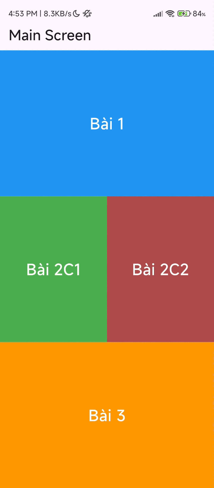
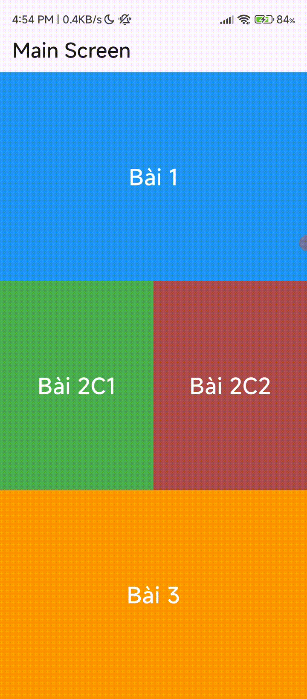

# fluter_intern_tech_master

# Bài 1:

### Hướng giải: 
- Sử dụng CustomPaint để vẽ.
- Sử dụng công thức vật lý để xác định tọa độ của con lắc.
- Sử dụng Ticker để tạo luồng thời gian.

### PromGPT đã sử dụng:
- Flutter vẽ con lắc đơn với CustomPaint.
- Viết hàm tính tọa độ con lắc đơn (có lực cản chuyển động), đầu ra là `Offset`.

### Kết quả đạt được:
- Màn hình mô phỏng con chuyển động của con lắc đơn.
  

  

# Bài 2:

### Hướng giải 1:
- Tạo class model là các line đại diện cho các dòng chat. Các line chứa thông tin:
  - Người gửi.
  - Màu sắc.
  - Giờ bắt đầu chạy (phục vụ cho ý 4).
- Các line chứa các word, và các word sẽ được load style dựa trên format của file TOML.
- Các word chứa các thông tin: 
  - `text`
  - `index_start` (phục vụ cho việc load style)
  - `style`
  - `highlight`.
- Sử dụng thư viện `just_audio` để lắng nghe stream và thực hiện các event (chuyển ảnh, highlight).

#### Luồng hoạt động của chương trình:
1. Khi bật lên, chạy hàm `prepare()` để load và xử lý data từ file TOML (load data vào các object cần thiết).
2. Khi chuẩn bị xong dữ liệu, stream audio chạy và lắng nghe. Khi đến khoảng thời gian có event xảy ra (chuyển ảnh), thì `setState` ảnh theo file TOML chỉ định.
3. Khi stream chạy, xác định từ nào đang được highlight và truyền lại data cho widget `bubble_chat` để widget cập nhật giao diện.
4. Khi nhấn vào dòng chat, phát âm thanh từ millisecond chỉ định trong file TOML.

> **Lưu ý:** Hướng giải này xử lý dữ liệu dựa trên từng từ một, **không thích hợp** nếu phát sinh những yêu cầu xử lý trên từng ký tự.

---

### Hướng giải 2: (xử lý từng chữ - tốn tài nguyên hơn)
- Các thư viện và luồng thực hiện tương tự Hướng giải 1, nhưng các thuộc tính xử lý trên từng ký tự.
- Hoạt động tốt nếu có thêm các yêu cầu xử lý trên từng ký tự. 
  - Ví dụ: Format cho 1 chữ cái.

### Kết quả đạt được:
- Load dữ liệu từ file toml để chuyển thành giao diện chat.
- Highlight từ đang được phát từ file audio.
- Phát file audio từ câu hội thoại được nhấn.
- Style các từ theo format của file toml chỉ định.
- Chuyển ảnh theo event trong file toml chỉ định.

  

# Bài 3:

### Hướng giải:
- Làm theo hướng dẫn trên Viblo:
  1. Viết file C++ giải phương trình bậc 2 (chỉnh kiểu dữ liệu để có thể gọi qua cầu nối).
  2. Cấu hình với Android:
     - Tạo file `CMakeLists.txt`, khi build app tạo ra thư viện `.so` cho cầu nối FFI gọi.
     - Khai báo build native trong `build.gradle(app)`.
  3. Cấu hình iOS:
     - Đặt file C++ vào thư mục `Runner.xcworkspace`.
     - Tạo cầu nối (dùng thư viện FFI để gọi đến thư viện `.so`).
  4. Vẽ giao diện theo đề bài yêu cầu.

### Kết quả đạt được:
- Tích hợp thư viện C vào dự án (Android + IOS).
- Sử dụng thư viện .so qua cầu nối ffi và hiển thị kết quả lên màn hình.

  

