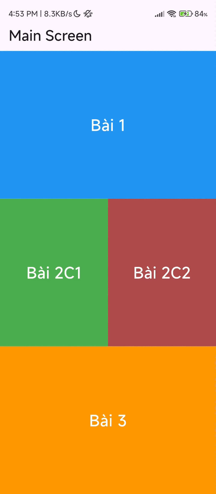

# Bài 1:
Hướng giải: 
Sử dụng CustomPaint để vẽ.
Sử dụng công thức vật lý để xác định tọa độ của con lắc
Sử dụng Ticker để tạo luồng thời gian
PromGPT đã sử dụng : 
Flutter vẽ con lắc đơn với custompaint
Viết hàm tính tọa độ con lắc đơn (có lực cản chuyển động),
đầu ra là Offset

  

