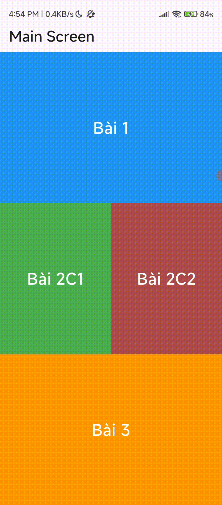

# Bài 3:
Hướng giải :
Làm theo hướng dẫn trên viblo:
Viết file cpp giải pt bậc 2 (chỉnh kiểu dữ liệu để có thể gọi qua
cầu nối)
Cấu hình với android : Tạo fileCmake, khi build app tạo ra thư viện so
cho cầu nối ffi gọi. khai báo build native trong buildgrade(app)
Cấu hình ios : đặt file cpp vào thư mục Runner.xcworkspace
Tạo cầu nối (dùng thư viện ffi để gọi đến thư viện so)
Vẽ giao diện theo đề bài yêu cầu
